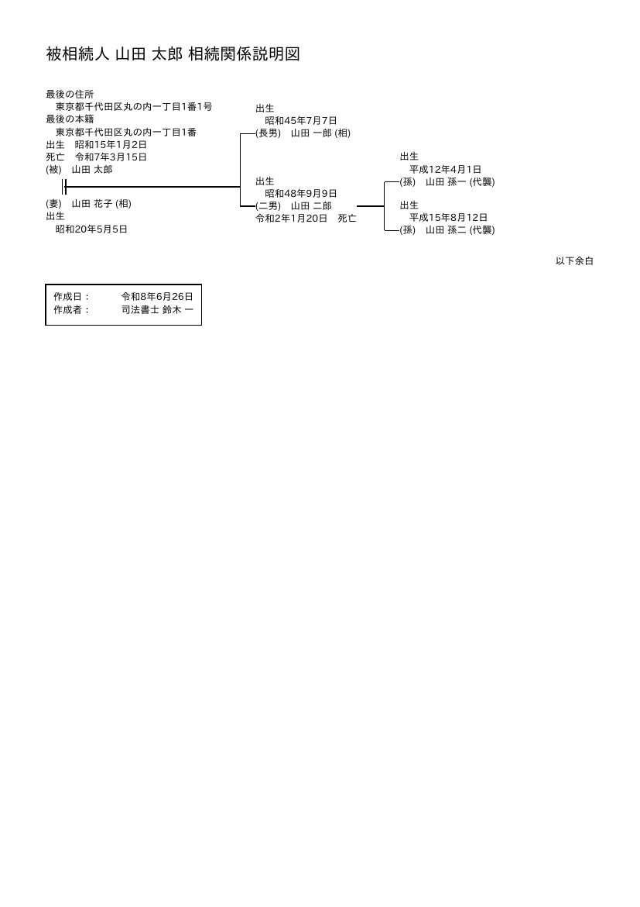
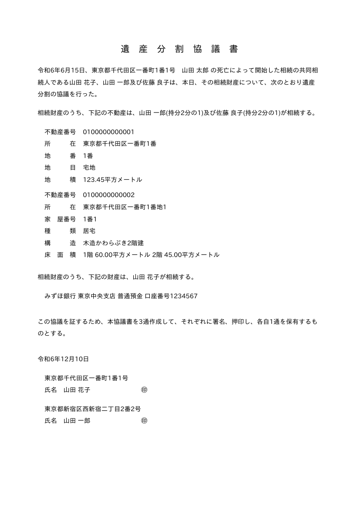
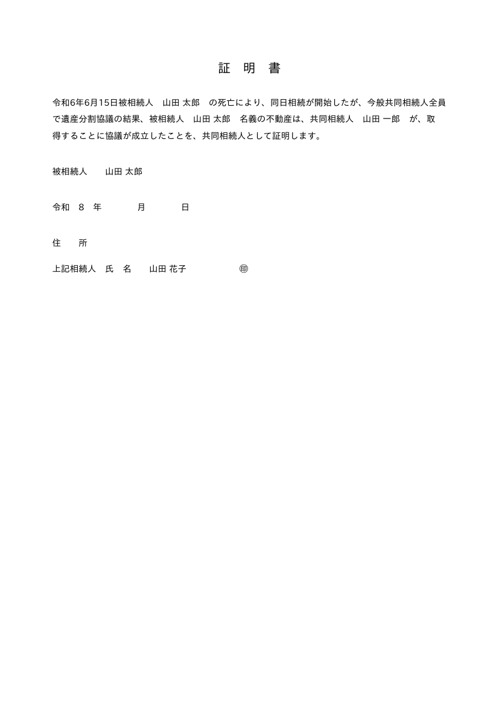
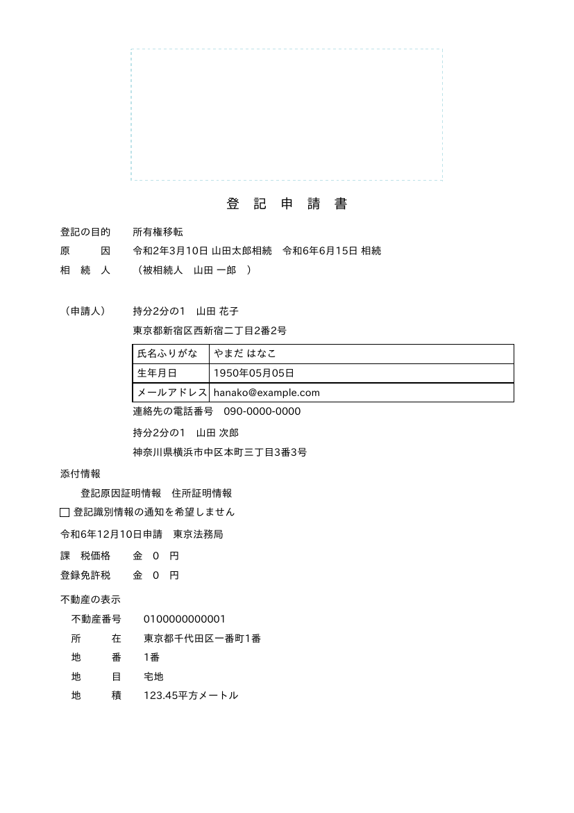
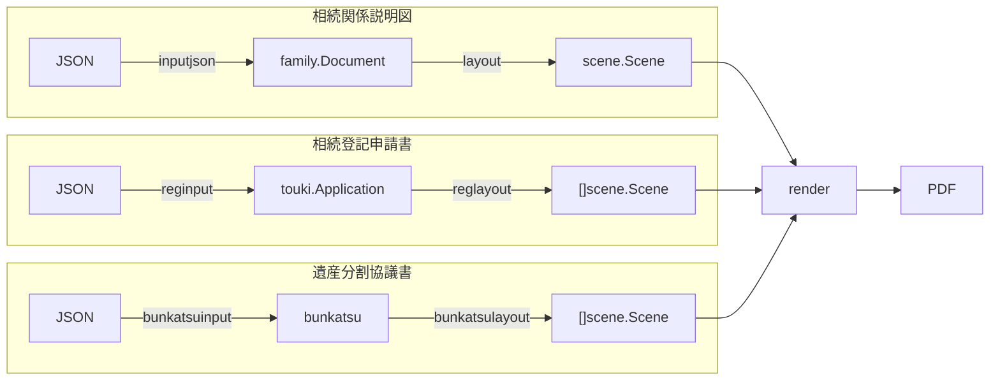
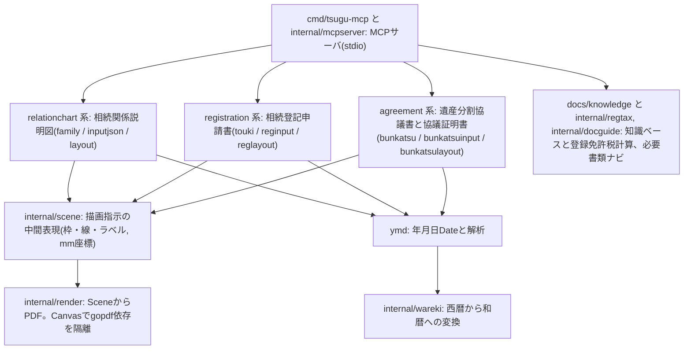

# tsugu-mcp

相続登記(不動産の名義変更)を自分で準備するためのMCPです。LLMと対話しながら、相続関係説明図や遺産分割協議書、登記申請書といった書類のPDFを作れます。必要書類の案内や法定相続分、登録免許税、申請義務の期限も、その場で確認できます。

使い方はCLIとGoライブラリ、MCPサーバの3通りです。日付は既定で和暦表示です(西暦併記にも切り替えられます)。

> [!IMPORTANT]
> 本ツールは法的助言ではなく、本人申請の準備を支援する情報提供です。税額や必要書類、様式は参考情報で、個別事案の正確性や最新性は保証しません。生成したPDFは下書きとして扱い、提出前に、登記事項証明書との一致、戸籍の連続性、評価額の最新年度を必ず確認してください。複雑な事案や判断に迷う点は、司法書士や弁護士、管轄法務局へご相談ください。

## 何ができるか

厄介な書類をまとめて作れます。JSONを渡すとPDFを出力します。

| 書類 | 用途 |
|------|------|
| 相続関係説明図 | 被相続人と相続人の関係を1枚にまとめた図です。戸籍一式の原本還付に使います |
| 遺産分割協議書 | 誰が何を取得するか相続人全員で取り決めた書面です。実印押印と印鑑証明をセットで使います |
| 遺産分割協議証明書 | 相続人ごとに1枚で取得を証明する個別書面型です。協議書の代わりに使えます |
| 相続登記申請書 | 法務局へ出す所有権移転の申請書です。評価額を渡せば登録免許税まで自動で計算します |

判断も助けます。知識ベースに基づいて案内します。

- 法定相続分の算定(配偶者と順位の組合せ、半血や代襲を分数で)
- 申請様式の選択(ケースA法定相続からH配偶者居住権まで)
- 必要書類のナビ(相続方法や相続人パターン別)
- 登録免許税の計算(合算や端数処理、免税の文言)
- 申請義務の期限の算定と相続人申告登記の案内

## 出力サンプル

`testdata`のサンプルJSONから生成したPDFの1ページ目です。

<p>
  
  
  
  
</p>

## クイックスタート(LLMと使う / recommended)

相続手続きが初めてなら、この使い方がいちばん手軽です。Claude等のMCPクライアントに登録して、対話しながら準備を進めます。

### 1. 入手

[リリースページ](https://github.com/chan-mai/tsugu-mcp/releases/latest)からOSとCPUに合うビルド済みバイナリ(`tsugu-mcp_<version>_<os>_<arch>`、Windowsは`.exe`)をダウンロードする方法です。macOSとLinuxはダウンロード後に実行権限を付けます。

```sh
chmod +x tsugu-mcp_*_darwin_arm64
```

macOSで未署名バイナリがブロックされる場合は`xattr -dr com.apple.quarantine <file>`で解除できます。

Goがあるなら`go install`でも入り、実行ファイルは`$(go env GOPATH)/bin/tsugu-mcp`に置かれます。

```sh
go install github.com/chan-mai/tsugu-mcp/cmd/tsugu-mcp@latest
```

ソースからビルドすることもできます。

```sh
git clone https://github.com/chan-mai/tsugu-mcp
cd tsugu-mcp
go build -o tsugu-mcp ./cmd/tsugu-mcp
```

### 2. クライアントに登録

Claude Desktopなら設定ファイル、Claude Codeなら`claude mcp add`等で、実行ファイルの絶対パスを登録します。

```json
{
  "mcpServers": {
    "tsugu": { "command": "/absolute/path/to/tsugu-mcp" }
  }
}
```

### 3. 話しかける

クライアントのプロンプト一覧から相続登記の準備ガイド(`prepare_inheritance_registration`)を選ぶか、「相続登記の準備をしたい」と話しかけてください。あとはガイドが次の順で、聞き取りから判定、生成まで案内します。

1. ヒアリング(被相続人、相続人全員、対象不動産、相続方法。相続方法は法定相続か遺産分割協議か遺言)
2. 相続人パターンの判定(必要なら法定相続分も確認します)
3. 申請様式の判定(目的や原因、税率、添付の要点)
4. 必要書類の提示(戸籍範囲や入手先、手数料の目安)
5. 登録免許税の計算
6. PDF生成(相続関係説明図、遺産分割協議書、登記申請書)
7. 申請義務の期限確認(間に合わない場合は相続人申告登記を案内します)

一括で片付けたければ、名寄せ帳と戸籍一式をスキャンして、PDFを添付して「相続登記の準備をしたい」と話しかけるだけでも、必要書類や期限、PDF生成まで案内されるはずです。推奨はしませんが。

## MCPツール一覧

書類生成ツールは入力 `{ document, outputPath?, era? }` を受け取り、生成したPDFのファイルパスを返します。`document`は後述の入力JSONと同じ構造です。`outputPath`を省略すると一時ファイルに出力します。

書類生成のツールは次のとおりです。

- `generate_relationship_chart`(相続関係説明図)
- `generate_division_agreement`(遺産分割協議書)
- `generate_division_certificate`(遺産分割協議証明書。相続人ごとに1ページ)
- `generate_registration_application`(相続登記申請書。各不動産に `value`=評価額 を渡すと登録免許税を自動計算)

判定と計算のツールは`docs/knowledge`に基づきます。法的助言ではなく情報提供で、出力に免責を付します。

- `calculate_statutory_shares`(法定相続分の算定。民法900/901条。配分の判断はしません)
- `select_application_pattern`(ケース別様式の選択。AからHの目的や原因、申請構造、税率、添付)
- `list_required_documents`(必要書類ナビ。添付情報4分類)
- `calculate_registration_tax`(登録免許税の計算)
- `guide_heir_notification`(申請義務期限の算定と相続人申告登記の案内)

知識リソースとして、`docs/knowledge`の8文書を`knowledge://<slug>`で公開しています(入口は`knowledge://index`)。ホストやLLMが必要に応じて参照します。

プロンプトは`prepare_inheritance_registration`の1本で、上記クイックスタートのガイド導線です。

## CLIで使う

入力JSONが手元にあれば、コマンド1本でPDFにできます。

```sh
go build -o tsugu ./cmd/tsugu

./tsugu chart       -in testdata/sample_full.json        -out chart.pdf     # 相続関係説明図
./tsugu bunkatsu    -in testdata/bunkatsu_sample.json    -out bunkatsu.pdf  # 遺産分割協議書
./tsugu certificate -in testdata/certificate_sample.json -out cert.pdf      # 遺産分割協議証明書
./tsugu touki       -in testdata/touki_sample.json       -out touki.pdf     # 相続登記申請書
./tsugu chart -era both < family.json > chart.pdf                           # 標準入出力 / 西暦併記
```

`testdata/`に各書類のサンプルJSONがあります。共通フラグは次のとおりです。

| フラグ | 既定 | 内容 |
|--------|------|------|
| `-in`  | 標準入力 | 入力JSONのパス |
| `-out` | 標準出力 | 出力PDFのパス |
| `-era` | `wareki` | 日付表記。`wareki`(和暦) / `both`(和暦+西暦) / `seireki` |

## ライブラリとして使う

```sh
go get github.com/chan-mai/tsugu-mcp
```

```go
import (
	"github.com/chan-mai/tsugu-mcp/agreement"
	"github.com/chan-mai/tsugu-mcp/registration"
	"github.com/chan-mai/tsugu-mcp/relationchart"
)

// 相続関係説明図
pdf, err := relationchart.GenerateFromJSON(chartJSON, relationchart.DefaultOptions())
// 遺産分割協議書
pdf, err := agreement.GenerateFromJSON(bunkatsuJSON, agreement.DefaultOptions())
// 遺産分割協議証明書
pdf, err := agreement.GenerateCertificateFromJSON(certJSON, agreement.DefaultOptions())
// 相続登記申請書
pdf, err := registration.GenerateFromJSON(toukiJSON, registration.DefaultOptions())
```

## 入力JSON

### 相続関係説明図

人物は所属(spouse / children / descendants / ascendants / siblings)とネストで関係を表します。children/siblingsの各ノードは、自分の`spouse`と`descendants`(代襲)を持てます。

```jsonc
{
  "decedent": {                          // 被相続人(必須: name, deathDate)
    "name": "山田 太郎",
    "registeredDomicile": "東京都千代田区一番町1番地",  // 本籍
    "lastAddress": "東京都千代田区一番町1番1号",        // 最後の住所
    "birthDate": "1940-01-01",           // YYYY-MM-DD
    "deathDate": "2024-06-15"
  },
  "spouse": { "name": "山田 花子", "relationship": "妻" },
  "children": [
    { "name": "山田 一郎", "relationship": "長男" },
    { "name": "山田 次郎", "relationship": "二男", "deathDate": "2020-03-10",
      "spouse": { "name": "山田 梅子", "relationship": "妻" },
      "descendants": [                                   // 代襲(任意世代)
        { "name": "山田 三郎", "relationship": "長男" },
        { "name": "佐藤 良子", "relationship": "二女", "applicant": true,
          "address": "東京都新宿区西新宿2番2号", "birthDate": "1975-05-05",
          "outcome": "inherit" }
      ] }
  ],
  "ascendants": [ { "name": "山田 祖一", "relationship": "父" } ],  // 直系尊属(父母)
  "siblings":   [ { "name": "山田 春夫", "relationship": "弟" } ],  // 兄弟姉妹
  "preparer": { "address": "東京都新宿区西新宿2番2号", "name": "佐藤 良子" },
  "preparedAt": "2024-12-10"
}
```

- `outcome`(注記)は、`inherit`が`(相)`、`renounce`が`(相続放棄)`、`division`が`(分割)`、`by_representation`が`(代襲)`です。和文(`相続`等)も使えます。
- `applicant: true`で`(申立人)`を付します。
- `relationship`(続柄)は表示用の自由文字列です。役割は配置(children/ascendants/siblings, descendants)とネストで表します。
- `ascendants`があると尊属を根とし、被相続人と`siblings`をその子として描きます。
- 本ツールは与えられた家族構成を描くレンダラに徹していて、法定相続人や相続分の算定は行いません。

### 相続登記申請書

登記の目的は所有権移転で固定のため、JSONには含めません。`applicants`は複数人と持分を、`properties`は土地と建物を混在して書けます。件数が多いと自動でページを送ります。

```jsonc
{
  "causes": [                                  // 原因(数次相続で複数併記)
    { "date": "2020-03-10", "text": "山田太郎相続" }, { "date": "2024-06-15", "text": "相続" }
  ],
  "decedent": { "name": "山田 一郎" },
  "applicants": [
    { "name": "山田 花子", "address": "東京都新宿区西新宿二丁目2番2号", "share": "2分の1",
      "nameKana": "やまだ はなこ", "birthDate": "1950-05-05",
      "email": "hanako@example.com", "phone": "090-0000-0000", "contact": true },
    { "name": "山田 次郎", "address": "神奈川県横浜市中区本町三丁目3番3号", "share": "2分の1" }
  ],
  "attachments": ["登記原因証明情報", "住所証明情報"],
  "declineIdInfo": false,                       // 登記識別情報の通知欄: false=□ / true=☑
  "applicationDate": "2024-12-10", "registry": "東京法務局",
  "taxValue": "0", "registrationTax": "0",      // value指定時は自動計算で補完
  "properties": [
    { "kind": "land",     "number": "...", "location": "...", "lotNumber": "1番", "landCategory": "宅地", "area": "123.45", "value": 12000000 },
    { "kind": "building", "number": "...", "location": "...", "houseNumber": "1番1",
      "buildingType": "居宅", "structure": "木造2階建", "floorArea": "1階 60.00平方メートル", "value": 5000000 }
  ]
}
```

- `kind`は`land`(土地。地番/地目/地積)か`building`(建物。家屋番号/種類/構造/床面積)です。
- 各不動産に`value`(固定資産評価額。単位は円)を渡すと、課税価格と登録免許税を自動で計算します。渡さなければ`taxValue`と`registrationTax`の文字列をそのまま描きます。
- `contact: true`の申請人には、氏名ふりがなや生年月日、メールの枠表と連絡先電話を付します。

## ライセンス

本ツールのコードは[AGPL-3.0](LICENSE)です。改変して配布する場合や、ネットワーク越しにサービスとして提供する場合は、利用者へソースコードを開示する義務があります(AGPL 13条)。MCPサーバーやWebサービスとして公開するときは特に注意してください。

同梱するIPAexゴシックは[IPAフォントライセンスv1.0](assets/fonts/IPA_Font_License_Agreement_v1.0.txt)で、埋め込みと再配布ができます。

---

# 開発者向け

## 設計

データを一方向に流す層構造です。各層は描画ライブラリに依存せず、単体テストできます。書類どうしは中間表現と描画を共有し、モデルとJSON境界、レイアウトは書類ごとに分けています。



共有パッケージはymd、wareki、scene、renderです。各パッケージの責務は次のとおりです。



レイアウトは、Documentを1本の家系ツリー(`tree.go`)に変換し、左から右へ世代を列に割り当てて配置します。人物は枠なしのカード(`card.go`)で、関係線は縦の婚姻二重線と親子ブラケットです。幾何計算が純粋なので、`HeuristicMeasurer`を使えば実フォントなしで座標を検証できますし、描画は`Canvas`抽象を介すのでフェイクで呼び出しを検証できます。

## フォント

日本語表示には、IPAexゴシック(TrueType)を`go:embed`で同梱し、PDFにサブセット埋め込みしています。ライセンスは[IPAフォントライセンスv1.0](assets/fonts/IPA_Font_License_Agreement_v1.0.txt)で、埋め込みと再配布ができます。

## テスト

```sh
go test ./...   # 全層の単体・統合テスト
go vet ./...
```
